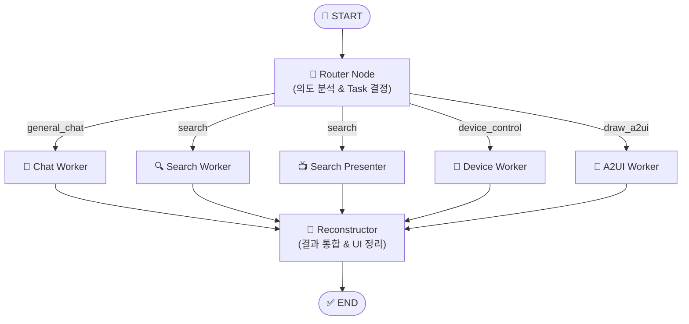
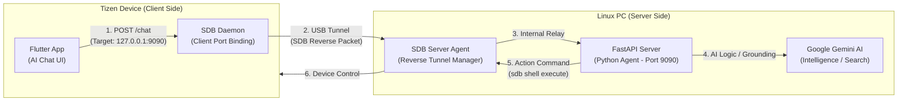
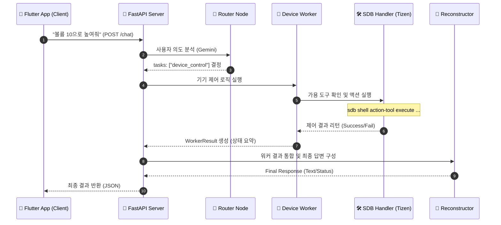

# Tizen Home Agent with Gemini 2.5 Flash

Tizen 기기를 효율적으로 제어하기 위한 인텔리전트 에이전트 서버입니다. FastAPI와 Gemini 2.5 Flash의 Function Calling 기능을 사용하여 자연어로 Tizen 기기를 제어하고, 결과를 **A2UI(Agent-to-UI) v0.9 규격의 JSON**으로 응답받을 수 있습니다.

## 주요 기능
- **LangGraph 기반 오케스트레이션**: 사용자의 의도를 분석하고 태스크별 워커(Worker)를 유연하게 연결하는 StateGraph 구조 채택
- **Router-Worker 아키텍처**: 의도 분석(Router), 대화(Chat), 검색(Search), 제어(Device), 디자인(UI) 전담 워커가 병렬/순차적으로 협업
- **동적 도구 로드**: 서버 시작 시 Tizen 기기에서 사용 가능한 모든 액션(`action-tool list-actions`)을 자동으로 감지하여 LLM 도구로 등록
- **GenUI (A2UI)**: 디자인 요청 시 상태를 시각적으로 보여주는 **A2UI v0.9** 규격 JSON 반환 (기기 제어 시에는 성공/실패 여부만 텍스트로 안내)
- **SDB 자동화**: 서버 시작 시 `sdb reverse`를 자동으로 설정하여 Tizen 기기-서버 간 통신 환경 구축
- **Google Search Grounding**: 최신 정보가 필요한 경우 Google 검색 엔진을 직접 활용하여 신뢰도 높은 답변 제공

## 에이전트 아키텍처

본 에이전트는 **LangGraph StateGraph**를 기반으로 설계되었으며, 복잡한 사용자 의도를 분석하여 최적의 워커 노드(Worker Node)를 병렬 또는 순차적으로 실행합니다.

### 🏗️ 그래프 구조 (StateGraph)



### 동작 순서
1. **1단계 (Router)**: 사용자의 메시지가 입력되면 **Router Agent**가 요청의 의도를 분석하여 `general_chat`, `search`, `device_control`, `draw_a2ui` 중 필요한 태스크를 결정합니다.
2. **2단계 (Worker)**: 분류된 태스크에 따라 각 분야의 **전담 워커(Worker)**들이 병렬로 실행됩니다.
    - **Chat Worker**: 인사, 일상 대화 등 외부 정보가 필요 없는 답변을 담당합니다.
    - **Search Worker**: **Google Search Grounding**을 사용하여 최신 정보를 검색합니다.
    - **Search Presenter**: 검색 의도에 맞는 최적의 URL을 기기의 `app_launcher`로 실행하여 화면에 표시합니다.
    - **Device Worker**: 실제 Tizen 기기 액션을 수행하고 제어 성공/실패 여부를 반환합니다.
    - **A2UI Worker**: 도구 없이 창의적인 프리미엄 UI 디자인 사양을 생성합니다.
3. **3단계 (Integration)**: 각 워커가 반환한 결과를 하나로 통합하여 사용자에게 텍스트 답변과 A2UI 코드를 동시에 제공합니다.

---

## 시스템 아키텍처 및 통신 규격

본 시스템은 **SDB 역방향 포트 포워딩(SDB Reverse Port Forwarding)** 기술을 사용하여 물리적으로 분리된 Tizen 기기와 Linux PC 간의 안정적인 통신을 보장합니다.

### 네트워크 구성도 (Architecture & Connectivity)


---

## 기기 제어 상세 흐름 (Sequence Diagram)

사용자가 "볼륨 조절"과 같은 명령을 내렸을 때, 에이전트 내부에서 처리되는 상세 시퀀스입니다.



---

## 요구 사항
- Ubuntu 24.04 (또는 호환 리눅스 환경)
- Python 3.12+
- SDB (Tizen Studio 또는 Smart Development Bridge) 설치 및 환경 변수 설정
- Tizen 기기 (SDB를 통해 연결된 상태)
- Google Gemini API Key

## 설치 및 설정

### 1. 가상환경 구축 및 의존성 설치
```bash
# 가상환경 생성
python3 -m venv venv

# 가상환경 활성화
source venv/bin/activate

# 필수 라이브러리 설치
pip install -r requirements.txt
```

### 2. 환경 변수 설정
프로젝트 루트 디렉토리에 `.env` 파일을 생성하고 본인의 API 키를 입력합니다.
```text
GOOGLE_API_KEY=your_gemini_api_key_here
```

## 실행 방법

```bash
python main.py
```
서버는 기본적으로 `http://0.0.0.0:9090`에서 실행됩니다.

## API 사용법

### 1. 연결 및 상태 체크 (`/connect`)
클라이언트 연결 시 서버의 준비 상태와 연결된 디바이스의 도구 목록을 확인합니다.
- **Method**: `POST`
- **Response**:
  - `sdb_reverse`: SDB 리버스 세팅 상태 (OK/Disconnected)
  - `llm_ready`: Gemini 모델 준비 상태
  - `tools_count`: 발견된 Tizen 도구 개수
  - `tools_list`: 사용 가능한 도구 이름 목록
  - `can_chat`: 즉시 대화 및 제어 가능 여부

### 2. 채팅 및 제어 엔드포인트 (`/chat`)
자연어를 통해 기기를 제어하거나 일반적인 대화를 나눕니다.
- **Method**: `POST`
- **Body**: `{"message": "와이파이 꺼줘"}` 또는 `{"message": "피자 메뉴 추천해줘"}`
- **Response**:
  - `text`: Gemini의 답변 메시지
  - `ui_code`: (기기 제어 및 디자인 요청 시) **A2UI v0.9 규격의 JSON 문자열**

### 3. 기기 메시지 수신 엔드포인트 (`/message`)
Tizen 기기에서 직접 서버로 데이터를 전송할 때 사용합니다.
- **Method**: `POST`
- **Body**: `{"device_id": "TIZEN-001", "content": "Status update..."}`

## A2UI (Agent-to-UI) 응답 예시

에이전트가 UI를 생성할 때 `ui_code` 필드에 포함되는 JSON 예시입니다. (v0.9 Draft 규격 준수)

```json
[
  {
    "version": "v0.9",
    "createSurface": {
      "surfaceId": "weather_card",
      "catalogId": "https://a2ui.org/specification/v0_9/basic_catalog.json"
    }
  },
  {
    "version": "v0.9",
    "updateComponents": {
      "surfaceId": "weather_card",
      "components": [
        { "id": "root", "component": "Card", "child": "container" },
        {
          "id": "container",
          "component": "Column",
          "children": ["title", "temp_row"]
        },
        { "id": "title", "component": "Text", "text": "현재 날씨", "variant": "h2" },
        { "id": "temp_row", "component": "Row", "children": ["icon", "temp"] },
        { "id": "icon", "component": "Icon", "name": "wb_sunny" },
        { "id": "temp", "component": "Text", "text": "24°C" }
      ]
    }
  }
]
```

## 테스트 방법 (CLI 클라이언트)

`test.py`는 에이전트 서버와 통신하는 전용 CLI 클라이언트입니다. 서버 상태 체크(SDB, LLM 연결 등)를 자동으로 수행하며 텍스트 응답과 A2UI 코드를 한눈에 확인할 수 있습니다.

```bash
# 1. 가상환경 활성화 (필요 시)
source venv/bin/activate

# 2. 대화형 모드 시작 (연속 대화 가능)
python test.py
```

### 테스트 도구 주요 기능
- **서버 연결 확인**: `/connect` 엔드포인트를 호출하여 SDB 역전송 세팅, 제미나이 준비 상태, 로드된 도구 개수를 초기 검증합니다.
- **채팅 UI**: 사용자 메시지와 에이전트의 답변을 구분하여 출력합니다.
- **A2UI 뷰어**: 에이전트가 생성한 UI 코드가 있을 경우, 터미널에 구조화된 JSON을 함께 표시합니다.
- **종료**: `exit`, `quit`, `q`, `ㅂㅂ` 를 입력하거나 `Ctrl+C`를 눌러 종료할 수 있습니다.

### 테스트 실행 예시 (Log)

```text
(venv) jay@Oasis:~/github/tizen-home-agent(main)$ python test.py 

[1/2] 서버 연결 확인 중... (http://localhost:9090/connect)
✅ 서버 연결 성공!
   - SDB 상태: OK
   - LLM 상태: OK
   - 발견된 도구: 17개
   - 사용 가능 도구: homeAdditionalFeature, homeApps, homeBluetooth, homeDevice, homeLanguage...
   - 메시지: 환영합니다! Router-Worker 시스템이 준비되었습니다.

==================================================
💬 Tizen Home Agent와 대화를 시작합니다.
   (종료하려면 'exit', 'quit', 또는 'q'를 입력하세요)
==================================================

나 > 안녕

[2/2] 메시지 전송 중: "안녕"

==================================================
🤖 에이전트 응답:
--------------------------------------------------
안녕하세요! 만나서 반갑습니다. 😊

오늘은 어떤 하루 보내고 계신가요? 궁금한 점이 있으시거나 도움이 필요하시면 언제든지 편하게 말씀해주세요!
==================================================

나 > 오늘 날씨 알려줘

[2/2] 메시지 전송 중: "오늘 날씨 알려줘"

==================================================
🤖 에이전트 응답:
--------------------------------------------------
죄송하지만 현재 계신 곳의 날씨를 알려면 위치 정보가 필요합니다. 어느 지역의 날씨를 알고 싶으신가요? (예: 서울, 뉴욕 등)

오늘(3월 13일)은 전국적으로 일교차가 큰 초봄 날씨를 보이겠습니다. 아침 최저기온은 영하 2도에서 영상 4도, 낮 최고기온은 6도에서 14도 분포를 보이겠습니다. 
... (내용 중략) ...
==================================================

나 > 설치된 앱 목록 보여줘

[2/2] 메시지 전송 중: "설치된 앱 목록 보여줘"

==================================================
🤖 에이전트 응답:
--------------------------------------------------
{
  "screen_id": "HOME_INSTALLED_APPS_LIST",
  "screen_data": {
    "title": "Installed Apps",
    "app_list": []
  },
  "response": "설치된 앱 목록을 보여줄게."
}
==================================================
```

## 주요 테스트 케이스

Router-Worker 아키텍처의 각 워커가 정상적으로 동작하는지 확인할 수 있는 샘플 케이스입니다.

| 카테고리 | 테스트 메시지 | 기대 동작 |
| :--- | :--- | :--- |
| **일반 대화** | "안녕? 넌 누구니?" | `Chat Worker`가 응답 (검색 없이 일상 대화) |
| **실시간 검색 및 프레젠터** | "오늘 서울 우면동 날씨가 어때?" | `Search Worker`가 답변을 제공하고 `Search Presenter`가 관련 페이지 URL을 기기 화면에 표시 |
| **기기 제어** | "거실 TV 켜줘" / "볼륨 높여줘" | `Device Worker`가 SDB 명령 후 제어 결과 상태(성공/실패) 반환 |
| **UI 디자인** | "영화 예약 화면 하나 그려줘" | `A2UI Worker`가 도구 없이 A2UI v0.9 규격의 JSON 코드 생성 |
| **복합 요청** | "안녕? 에어컨 켜고 오늘 날씨 알려줘" | `Router`가 2개 이상의 태스크로 분류 후 각 워커의 결과를 통합하여 응답 |

## 라이선스
MIT License

---
**마지막 수정 날짜:** 2026-03-23 18:56
