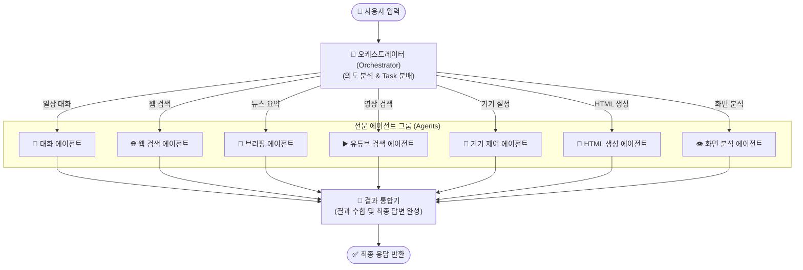
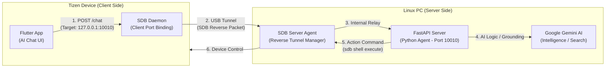
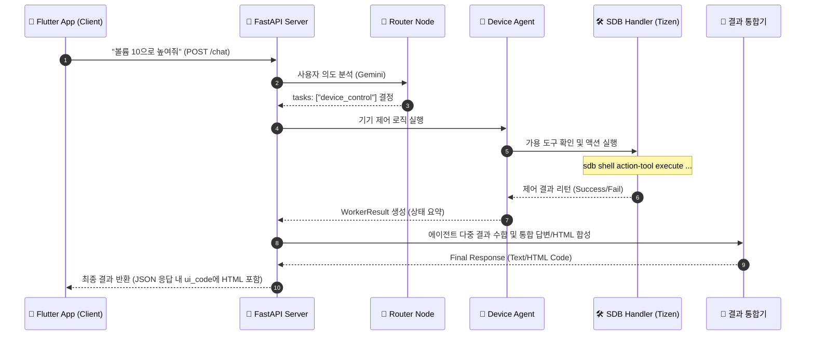

# Tizen Home Agent with Gemini 2.5 Flash

Tizen 기기를 효율적으로 제어하기 위한 인텔리전트 에이전트 서버입니다. FastAPI와 Gemini 2.5 Flash를 사용하여 자연어로 Tizen 기기를 제어하고, 실시간 정보 및 UI 화면을 **순수 HTML 기반의 UI**로 응답받을 수 있습니다.

## 주요 기능
- **LangGraph 기반 오케스트레이션**: 사용자의 의도를 분석하고 태스크별 에이전트(Agent)를 유연하게 연결하는 StateGraph 구조 채택
- **Router-Agent 아키텍처**: 의도 분석(Router), 대화(Chat), 웹 검색(Search), 제어(Device), HTML 생성 전담 에이전트가 협업
- **동적 도구 로드**: 서버 시작 시 Tizen 기기에서 사용 가능한 모든 액션(`action-tool list-actions`)을 자동으로 감지하여 LLM 도구로 등록
- **웹 기술 기반 UI**: 모든 시각화 결과를 단일 파일 HTML로 생성하여 Tizen 기기에 즉시 배포 및 실행
- **SDB 자동화**: 서버 시작 시 `sdb reverse`를 자동으로 설정하여 Tizen 기기-서버 간 통신 환경 구축
- **Google Search Grounding**: 최신 정보가 필요한 경우 Google 검색 엔진을 직접 활용하여 신뢰도 높은 답변 제공

## 에이전트 아키텍처

본 에이전트는 **LangGraph StateGraph**를 기반으로 설계되었으며, 복잡한 사용자 의도를 분석하여 최적의 에이전트 노드(Agent Node)를 병렬 또는 순차적으로 실행합니다.

### 🏗️ 그래프 구조 (StateGraph)



### 동작 순서
1. **1단계 (Orchestrator)**: 사용자의 메시지가 입력되면 요청의 의도를 분석하여 `general_chat`, `search`, `device_control`, `draw_ui`, `briefing`, `youtube_play`, `vision` 중 필요한 태스크를 결정합니다.
2. **2단계 (Agent)**: 분류된 태스크에 따라 7종의 **전담 에이전트(Agent)**들이 병렬로 실행됩니다.
    - **대화 에이전트 (ChatAgent)**: 인사, 일상 대화 등 외부 정보가 필요 없는 답변을 담당합니다.
    - **웹 검색 에이전트 (WebSearchAgent)**: 사용자의 의도에 따라 Google 검색으로 최신 정보를 찾고, 관련 웹 페이지 URL을 추출하여 반환합니다.
    - **브리핑 에이전트 (BriefingAgent)**: 정보를 기기에 카드 뉴스 형태의 전용 HTML로 생성하여 반환합니다.
    - **유튜브 검색 에이전트 (YouTubeAgent)**: 요청된 제목의 영상을 검색해 자립형 HTML 플레이어 코드를 생성하여 반환합니다.
    - **기기 제어 에이전트 (DeviceAgent)**: 실제 Tizen 기기 액션을 수행하고 제어 성공/실패 여부를 반환합니다.
    - **HTML 생성 에이전트 (HTMLGenAgent)**: 별도의 도구 호출 없이 창의적인 UI 화면을 순수 HTML 코드로 생성하여 반환합니다.
    - **화면 분석 에이전트 (VisionAgent)**: 현재 Tizen 기기의 화면을 캡처하여 어떤 내용이 표시되고 있는지 멀티모달 LLM으로 분석하여 설명합니다.
3. **3단계 (Integration)**: 각 에이전트가 반환한 결과를 통합하여 텍스트 답변과 최종 UI HTML 코드를 클라이언트에 전달합니다.

---

## 시스템 아키텍처 및 통신 규격

본 시스템은 **SDB 역방향 포트 포워딩(SDB Reverse Port Forwarding)** 기술을 사용하여 물리적으로 분리된 Tizen 기기와 Linux PC 간의 안정적인 통신을 보장합니다.

### 네트워크 구성도 (Architecture & Connectivity)


---

## 기기 제어 상세 흐름 (Sequence Diagram)

사용자가 "볼륨 조절"과 같은 명령을 내렸을 때, 에이전트 내부에서 처리되는 상세 시퀀스입니다.



---

## 요구 사항
- Ubuntu 24.04 (또는 호환 리눅스 환경)
- Python 3.12+
- SDB (Tizen Studio 또는 Smart Development Bridge) 설치 및 환경 변수 설정
- Tizen 기기 (SDB를 통해 연결된 상태)
- Google Gemini API Key

## 설치 및 설정

### 1. 가상환경 구축 및 의존성 설치
```bash
# 가상환경 생성
python3 -m venv venv

# 가상환경 활성화
source venv/bin/activate

# 필수 라이브러리 설치
pip install -r requirements.txt
```

### 2. 환경 변수 설정
프로젝트 루트 디렉토리에 `.env` 파일을 생성하고 본인의 API 키를 입력합니다.
```text
GOOGLE_API_KEY=your_gemini_api_key_here
```

## 실행 방법

```bash
python main.py
```
서버는 기본적으로 `http://0.0.0.0:10010`에서 실행됩니다.

## API 사용법

### 1. 연결 및 상태 체크 (`/connect`)
클라이언트 연결 시 서버의 준비 상태와 연결된 디바이스의 도구 목록을 확인합니다.
- **Method**: `POST`
- **Response**:
  - `sdb_reverse`: SDB 리버스 세팅 상태 (OK/Disconnected)
  - `llm_ready`: Gemini 모델 준비 상태
  - `tools_count`: 발견된 Tizen 도구 개수
  - `tools_list`: 사용 가능한 도구 이름 목록
  - `can_chat`: 즉시 대화 및 제어 가능 여부

### 2. 채팅 및 제어 엔드포인트 (`/chat`)
자연어를 통해 기기를 제어하거나 일반적인 대화를 나눕니다.
- **Method**: `POST`
- **Body**: `{"message": "와이파이 꺼줘"}` 또는 `{"message": "피자 메뉴 추천해줘"}`
- **Response**:
  - `text`: 에이전트의 최종 답변 메시지
  - `ui_code`: 생성된 **순수 HTML 코드** (있을 경우)

### 3. 기기 메시지 수신 엔드포인트 (`/message`)
Tizen 기기에서 직접 서버로 데이터를 전송할 때 사용합니다.
- **Method**: `POST`
- **Body**: `{"device_id": "TIZEN-001", "content": "Status update..."}`
- **Response**: `{"status": "captured"}`

## 테스트 방법 (CLI 클라이언트)

`test.py`는 에이전트 서버와 통신하는 전용 CLI 클라이언트입니다. 서버 상태 체크(SDB, LLM 연결 등)를 자동으로 수행하며 텍스트 응답과 HTML 코드를 한눈에 확인할 수 있습니다.

```bash
# 1. 가상환경 활성화 (필요 시)
source venv/bin/activate

# 2. 대화형 모드 시작 (연속 대화 가능)
python test.py
```

### 테스트 도구 주요 기능
- **서버 연결 확인**: `/connect` 엔드포인트를 호출하여 SDB 역전송 세팅, 제미나이 준비 상태, 로드된 도구 개수를 초기 검증합니다.
- **채팅 UI**: 사용자 메시지와 에이전트의 답변을 구분하여 출력합니다.
- **HTML 뷰어**: 에이전트가 생성한 HTML UI 코드가 있을 경우, 터미널에 코드의 요약을 표시합니다.
- **종료**: `exit`, `quit`, `q`, `ㅂㅂ` 를 입력하거나 `Ctrl+C`를 눌러 종료할 수 있습니다.

### 테스트 실행 예시 (Log)

```text
(venv) jay@Oasis:~/github/tizen-home-agent(main)$ python test.py 

[1/2] 서버 연결 확인 중... (http://localhost:10010/connect)
✅ 서버 연결 성공!
   - SDB 상태: OK
   - LLM 상태: OK
   - 발견된 도구: 19개
   - 사용 가능 도구: homeAdditionalFeature, homeApps, homeBluetooth, homeDevice, homeLanguage...
   - 메시지: 환영합니다! LangGraph 에이전트 시스템이 준비되었습니다.

==================================================
💬 Tizen Home Agent와 대화를 시작합니다.
   (종료하려면 'exit', 'quit', 또는 'q'를 입력하세요)
==================================================

나 > 설치된 앱 목록 보여줘

[2/2] 메시지 전송 중: "설치된 앱 목록 보여줘"

==================================================
🤖 에이전트 응답:
--------------------------------------------------
설치된 앱 목록이 성공적으로 표시되었습니다.
==================================================

나 > 화면에 ai_chat 이라는 글자가 있는지 알려줘

[2/2] 메시지 전송 중: "화면에 ai_chat 이라는 글자가 있는지 알려줘"

==================================================
🤖 에이전트 응답:
--------------------------------------------------
네, 화면에 'ai_chat' 글자가 있습니다.

1.  왼쪽 패널의 설치된 앱 목록에 'ai_chat' 앱 이름으로 표시됩니다.
    *   영역: [292, 237, 344, 407]
    *   중심 클릭 지점: (320, 322)
2.  오른쪽 패널의 앱 상세 정보 제목으로 'ai_chat'이 표시됩니다.
    *   영역: [142, 532, 194, 702]
    *   중심 클릭 지점: (168, 617)
==================================================

나 > 화면에 뭐 있는지 설명해줘

[2/2] 메시지 전송 중: "화면에 뭐 있는지 설명해줘"

==================================================
🤖 에이전트 응답:
--------------------------------------------------
화면에는 설치된 앱 목록과 선택된 앱의 상세 정보가 표시되어 있습니다.

왼쪽에는 'Installed Apps'라는 제목 아래 설치된 앱 목록이 보입니다. 현재 'ai_chat' 앱이 선택되어 있으며, 그 아래에는 'TizenFS' 앱도 목록에 있습니다. 각 앱의 이름과 크기(예: ai_chat 18.66 MB, TizenFS 33.86 MB)가 함께 표시되어 있습니다.

오른쪽에는 왼쪽에서 선택된 'ai_chat' 앱에 대한 상세 정보가 나타나 있습니다. 앱 이름 'ai_chat' 아래에 버전 정보(Version 1.0.0)와 패키지 이름(com.example.ai_chat)이 있습니다. 이어서 'Force Stop'(강제 중지)과 'Uninstall'(제거)과 같은 앱 관리 옵션들이 보입니다. 그 아래로는 앱의 저장 공간 사용량에 대한 상세 정보로 'Total Size'(총 크기, 18.66 MB), 'App Data'(앱 데이터, 7.89 MB), 'User Data'(사용자 데이터, 10.77 MB), 그리고 'Cache'(캐시) 항목이 있습니다.

화면의 오른쪽 하단에는 뒤로 가기 화살표와 홈 아이콘으로 보이는 내비게이션 버튼들이 있습니다.
==================================================
```


## 주요 테스트 케이스

각 에이전트가 정상적으로 동작하는지 확인할 수 있는 샘플 케이스입니다.

| 카테고리 | 테스트 메시지 | 기대 동작 |
| :--- | :--- | :--- |
| **일반 대화** | "안녕? 넌 누구니?" | `Chat Agent`가 응답 (검색 없이 일상 대화) |
| **웹 검색** | "오늘 서울 우면동 날씨가 어때?" | `Web Search Agent`가 정보를 검색하고 관련 페이지 URL을 화면에 표시 |
| **브리핑** | "애들 볼 거 추천해줘", "오늘 주요 뉴스 브리핑해줘" | `Briefing Agent`가 검색을 통해 추천 컨텐츠를 카드 뷰 형태로 화면에 표시 |
| **기기 제어** | "블루투스 켜줘", "볼륨 높여줘" | `Device Agent`가 SDB 명령 후 제어 결과 상태(성공/실패) 반환 |
| **HTML 생성** | "날씨 위젯 그려줘", "계산기 만들어줘" | `HTML 생성 에이전트`가 도구 없이 단일 HTML 코드 생성 |
| **유튜브 검색** | "아기상어 틀어줘" | `YouTube Agent`가 영상을 검색해 플레이 가능한 HTML로 만들어 화면에 표시 |
| **화면 분석** | "화면에 뭐 있는지 알려줘", "Tizen" 이라는 글자 화면에 있어?" | `Vision Agent`가 기기 화면을 캡처하여 현재 화면에 있는 텍스트 및 이미지 설명 |


## 라이선스
MIT License

---
**마지막 수정 날짜:** 2026-03-25 11:32

**수정 사항:** 
1. **에이전트 명칭 변경**: '뉴스 브리핑 에이전트'를 뉴스 외 다양한 추천 테스크를 아우르는 '브리핑 에이전트'로 명칭을 단순화했습니다.
2. **다국어(한/영) 주도적 추천 강화**: 영어 질문 시에도 추가 질문 없이 트렌드를 분석하여 즉시 추천 결과를 제공합니다.


