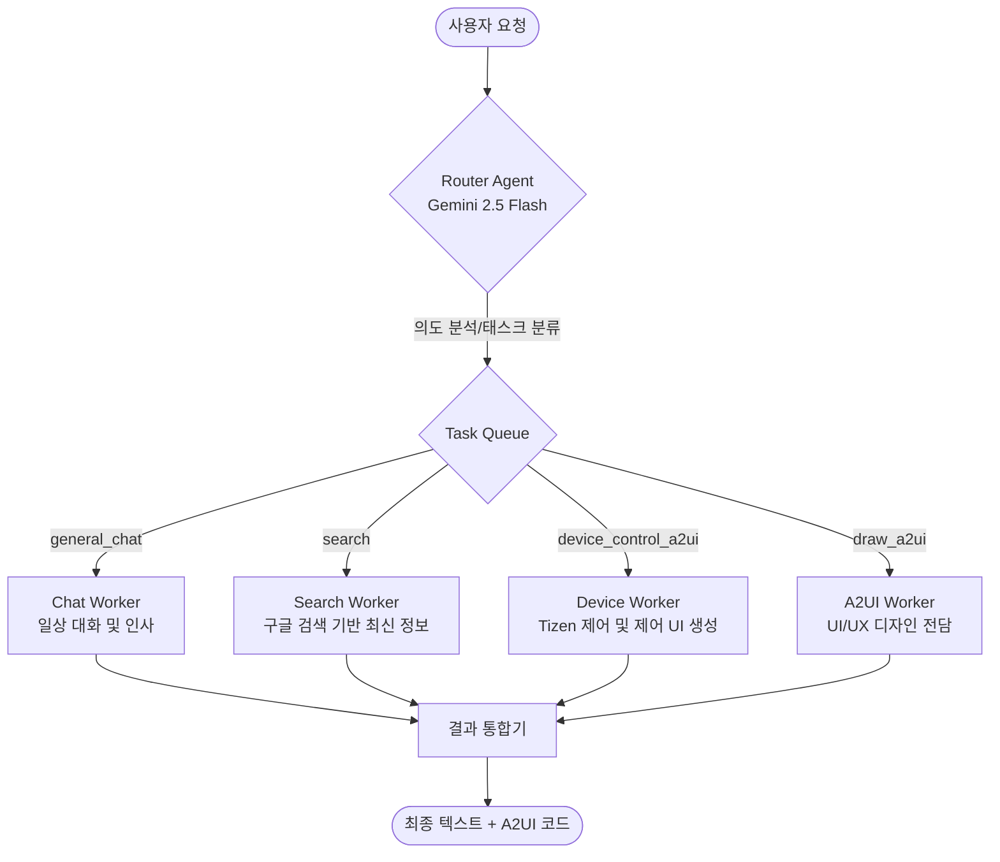

# Tizen Home Agent with Gemini 2.5 Flash

Tizen 기기를 효율적으로 제어하기 위한 인텔리전트 에이전트 서버입니다. FastAPI와 Gemini 2.5 Flash의 Function Calling 기능을 사용하여 자연어로 Tizen 기기를 제어하고, 결과를 **A2UI(Agent-to-UI) v0.9 규격의 JSON**으로 응답받을 수 있습니다.

## 주요 기능
- **동적 도구 로드**: 서버 시작 시 Tizen 기기에서 사용 가능한 모든 액션(`action-tool list-actions`)을 자동으로 감지하여 LLM 도구로 등록합니다.
- **다재다능한 AI 어시스턴트**: 기기 제어뿐만 아니라 일반적인 질문이나 일상 대화에도 자연스럽게 응답합니다.
- **자연어 기기 제어**: "와이파이 켜줘", "볼륨 조절해줘" 등 일상적인 명령어로 Tizen 기기 제어 가능
- **GenUI (A2UI)**: 기기 제어 성공 시 또는 디자인 요청 시 상태를 시각적으로 보여주는 A2UI v0.9 규격 JSON 반환
- **SDB 자동화**: 서버 시작 시 `sdb reverse` 명령어를 자동으로 실행하여 통신 환경 설정
- **Router-Worker 아키텍처**: 사용자의 요청을 분석하는 Router와 목적별 전담 Worker(검색, 제어, 디자인)로 구성된 고성능 에이전트 엔진

## 에이전트 아키텍처

본 에이전트는 효율적인 작업 분배와 정확한 응답을 위해 **2단계 라우터-워커(Router-Worker)** 구조로 동작합니다.



### 동작 순서
1. **1단계 (Router)**: 사용자의 메시지가 입력되면 **Router Agent**가 요청의 의도를 분석하여 `general_chat`, `search`, `device_control_a2ui`, `draw_a2ui` 중 필요한 태스크를 결정합니다.
2. **2단계 (Worker)**: 분류된 태스크에 따라 각 분야의 **전담 워커(Worker)**들이 병렬로 실행됩니다.
    - **Chat Worker**: 인사, 일상 대화 등 외부 정보가 필요 없는 답변을 담당합니다.
    - **Search Worker**: **Google Search Grounding**을 사용하여 최신 정보를 검색합니다.
    - **Device Worker**: 실제 Tizen 기기 액션을 수행하고 제어 결과 UI를 생성합니다.
    - **A2UI Worker**: 도구 없이 창의적인 프리미엄 UI 디자인 사양을 생성합니다.
3. **3단계 (Integration)**: 각 워커가 반환한 결과를 하나로 통합하여 사용자에게 텍스트 답변과 A2UI 코드를 동시에 제공합니다.

## 요구 사항
- Ubuntu 24.04 (또는 호환 리눅스 환경)
- Python 3.12+
- SDB (Tizen Studio 또는 Smart Development Bridge) 설치 및 환경 변수 설정
- Tizen 기기 (SDB를 통해 연결된 상태)
- Google Gemini API Key

## 설치 및 설정

### 1. 가상환경 구축 및 의존성 설치
```bash
# 가상환경 생성
python3 -m venv venv

# 가상환경 활성화
source venv/bin/activate

# 필수 라이브러리 설치
pip install -r requirements.txt
```

### 2. 환경 변수 설정
프로젝트 루트 디렉토리에 `.env` 파일을 생성하고 본인의 API 키를 입력합니다.
```text
GOOGLE_API_KEY=your_gemini_api_key_here
```

## 실행 방법

```bash
python main.py
```
서버는 기본적으로 `http://0.0.0.0:8080`에서 실행됩니다.

## API 사용법

### 1. 연결 및 상태 체크 (`/connect`)
클라이언트 연결 시 서버의 준비 상태와 연결된 디바이스의 도구 목록을 확인합니다.
- **Method**: `POST`
- **Response**:
  - `sdb_reverse`: SDB 리버스 세팅 상태 (OK/Disconnected)
  - `llm_ready`: Gemini 모델 준비 상태
  - `tools_count`: 발견된 Tizen 도구 개수
  - `tools_list`: 사용 가능한 도구 이름 목록
  - `can_chat`: 즉시 대화 및 제어 가능 여부

### 2. 채팅 및 제어 엔드포인트 (`/chat`)
자연어를 통해 기기를 제어하거나 일반적인 대화를 나눕니다.
- **Method**: `POST`
- **Body**: `{"message": "와이파이 꺼줘"}` 또는 `{"message": "피자 메뉴 추천해줘"}`
- **Response**:
  - `text`: Gemini의 답변 메시지
  - `ui_code`: (기기 제어 및 디자인 요청 시) **A2UI v0.9 규격의 JSON 문자열**

### 3. 기기 메시지 수신 엔드포인트 (`/message`)
Tizen 기기에서 직접 서버로 데이터를 전송할 때 사용합니다.
- **Method**: `POST`
- **Body**: `{"device_id": "TIZEN-001", "content": "Status update..."}`

## A2UI (Agent-to-UI) 응답 예시

에이전트가 UI를 생성할 때 `ui_code` 필드에 포함되는 JSON 예시입니다. (v0.9 Draft 규격 준수)

```json
[
  {
    "version": "v0.9",
    "createSurface": {
      "surfaceId": "weather_card",
      "catalogId": "https://a2ui.org/specification/v0_9/basic_catalog.json"
    }
  },
  {
    "version": "v0.9",
    "updateComponents": {
      "surfaceId": "weather_card",
      "components": [
        { "id": "root", "component": "Card", "child": "container" },
        {
          "id": "container",
          "component": "Column",
          "children": ["title", "temp_row"]
        },
        { "id": "title", "component": "Text", "text": "현재 날씨", "variant": "h2" },
        { "id": "temp_row", "component": "Row", "children": ["icon", "temp"] },
        { "id": "icon", "component": "Icon", "name": "wb_sunny" },
        { "id": "temp", "component": "Text", "text": "24°C" }
      ]
    }
  }
]
```

## 테스트 방법 (CLI 클라이언트)

`test.py`를 사용하면 별도의 `curl` 명령어 없이 터미널에서 간편하게 에이전트와 대화할 수 있습니다.

```bash
# 대화형 모드 시작 (연속 대화 가능)
python test.py

# 실행 시 바로 메시지 전달
python test.py "와이파이 켜줘"
```

- **종료**: `exit`, `quit`, `q` 또는 `Ctrl+C` 입력
- **특징**: 서버 상태 체크, 텍스트 응답 출력, 생성된 A2UI JSON 코드 확인 가능

## 라이선스
MIT License
