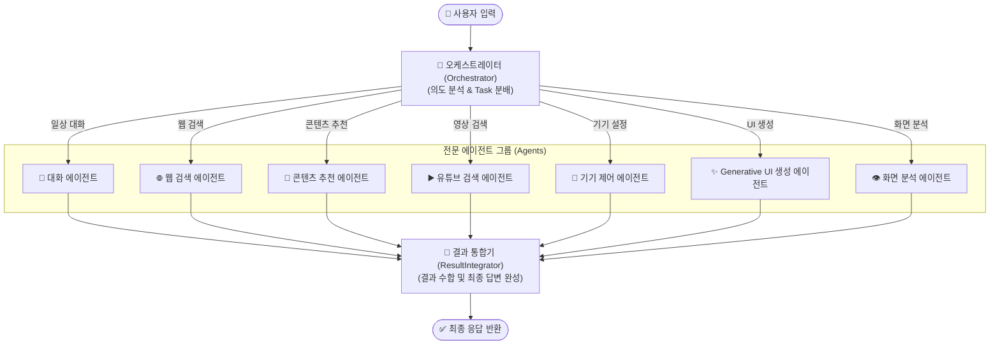
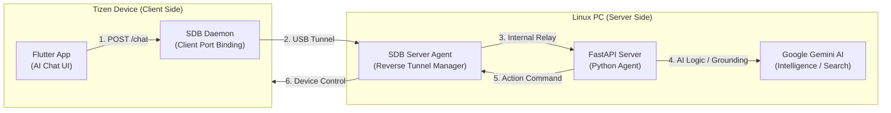
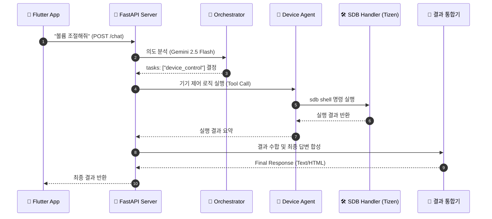

# Tizen Home Agent System Architecture

Tizen Home Agent는 **LangGraph** 기반의 **Orchestrator-Agent** 구조를 채택하여, 사용자의 복잡한 의도를 분석하고 최적화된 전문 에이전트들을 통해 작업을 수행하는 지능형 시스템입니다.

## 1. 에이전트 그래프 구조 (StateGraph)

본 시스템은 LangGraph의 `StateGraph`를 사용하여 에이전트 간의 워크플로우를 관리합니다. 오케스트레이터가 의도를 분석하면, 병렬로 다수의 전문 에이전트가 실행되고 최종적으로 결과 통합기가 이를 취합합니다.

## 2. 시스템 구성도 (System Connectivity)

물리적으로 분리된 Tizen 기기와 서버 간의 통신은 **SDB Reverse Port Forwarding**을 통해 이루어지며, 이를 통해 서버의 API 엔드포인트가 기기에 노출됩니다.

## 3. 기기 제어 상세 흐름 (Sequence Diagram)

사용자의 명령이 실제 기기 제어로 이어지는 상세 프로세스입니다.

## 4. 핵심 에이전트 상세 정보

| 에이전트 명칭 | 역할 및 기능 | 활용 기술 |
| :--- | :--- | :--- |
| **오케스트레이터** | 사용자의 입력을 분석하여 필요한 워커 에이전트 결정 및 태스크 할당 | Gemini 2.5 Flash |
| **콘텐츠 추천 에이전트** | 사용자 상황에 맞는 뉴스, 미디어, 할 일 등을 추천하고 카드 형태 UI 생성 | Search Grounding |
| **Generative UI 생성 에이전트** | 특수한 UI가 필요한 경우 순수 HTML/CSS/JS 코드로 동적 화면 생성 | Advanced Prompting |
| **기기 제어 에이전트** | 로드된 Tizen Action Tool을 사용하여 물리적 하드웨어 제어 | SDB / action-tool |
| **결과 통합기** | 여러 에이전트의 결과물을 자연스러운 문장과 완성된 UI 패키지로 합성 | LangGraph State |
